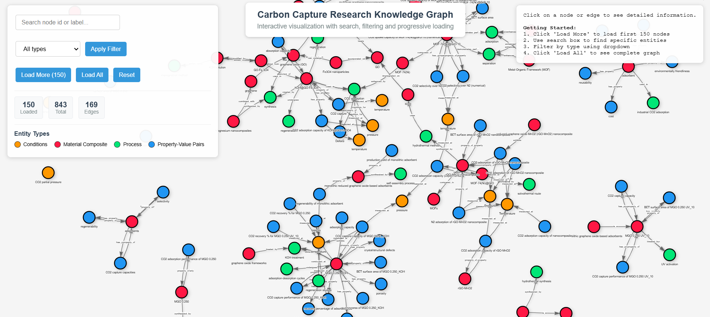
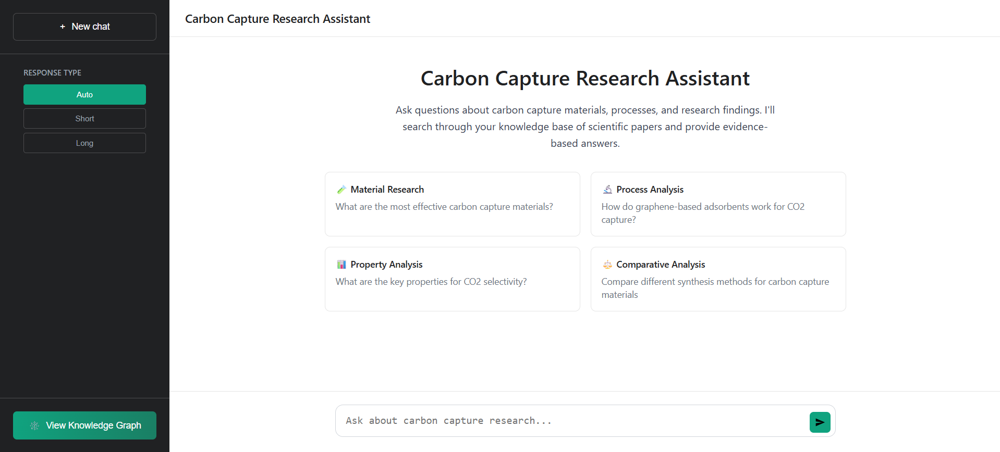
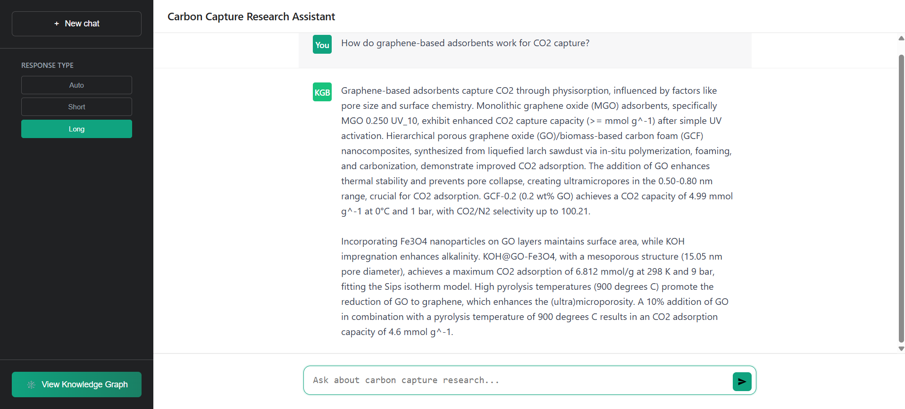
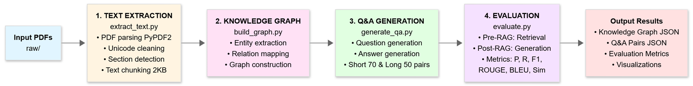

# Knowledge Graph RAG Pipeline

A comprehensive pipeline for building, visualizing, and querying knowledge graphs from PDF documents with a RAG-powered chatbot interface.

## 🚀 Features

- **Automated Text Extraction**: Extract and process text from PDF documents
- **Knowledge Graph Construction**: Build structured knowledge graphs with entities and relationships
- **Interactive Visualization**: Explore the knowledge graph with an interactive web interface
- **QA Generation**: Automatically generate question-answer pairs from the knowledge base
- **RAG Chatbot**: Query the knowledge graph using a conversational AI interface
- **Performance Evaluation**: Comprehensive metrics for pipeline quality assessment

## 📊 Screenshots

### Knowledge Graph Visualization


### Chatbot Interface


### Sample Conversation


### Pipeline Methodology


## 🛠️ Installation

### Prerequisites

- Python 3.8+
- Google Gemini API Key

### Setup

1. **Clone the repository**

```bash
git clone https://github.com/naveensankar5905/Knowledge-Graph-Enhanced-Retrieval-Augmented-Generation-for-Low-Latency-Carbon-Capture-Research.git
cd Knowledge-Graph-Enhanced-Retrieval-Augmented-Generation-for-Low-Latency-Carbon-Capture-Research
```

2. **Install dependencies**

```bash
pip install -r requirements.txt
```

3. **Configure environment**

- Copy `.env.example` to `.env`
- Add your Gemini API key:
```
GEMINI_API_KEY=your_api_key_here
```

4. **Prepare your data**

- Place PDF files in the `raw/` folder

## 🎯 Usage

### Run Complete Pipeline

Execute all steps sequentially:

```bash
python main.py
```

This will:
1. Extract text from PDFs
2. Build the knowledge graph
3. Generate QA pairs
4. Evaluate the pipeline
5. Create visualizations

### Run Individual Steps

**Extract Text:**
```bash
python extract_text.py
```

**Build Knowledge Graph:**
```bash
python build_graph.py
```

**Generate Q&A Pairs:**
```bash
python generate_qa.py
```

**Evaluate Pipeline:**
```bash
python evaluate.py
```

**Create Visualization:**
```bash
python create_kg_visualization.py
python open_visualization.py
```

### Launch Chatbot

Start the RAG-powered chatbot interface:

```bash
python rag_chatbot.py
```

Then open your browser to `http://localhost:5000`

## 📁 Project Structure

```
.
├── raw/                          # Input PDF files
├── output/                       # Generated outputs
│   ├── extracted_texts.json
│   ├── knowledge_graph.json
│   ├── qa_short.json
│   ├── qa_long.json
│   ├── evaluations.json
│   └── knowledge_graph_visualization.html
├── templates/                    # HTML templates for chatbot
├── Images/                       # Screenshots and diagrams
├── main.py                       # Main pipeline runner
├── extract_text.py               # Text extraction module
├── build_graph.py                # Knowledge graph builder
├── generate_qa.py                # QA pair generator
├── evaluate.py                   # Evaluation module
├── rag_chatbot.py                # Chatbot application
├── create_kg_visualization.py    # Visualization generator
├── requirements.txt              # Python dependencies
└── .env                          # Environment configuration
```

## 🔧 Configuration

### API Settings

Configure the Gemini API in `.env`:

- **GEMINI_API_KEY**: Your Google Gemini API key

### Pipeline Parameters

Modify parameters in individual scripts:

- **Chunk size**: Text segmentation size
- **Temperature**: LLM creativity level
- **Top-k retrieval**: Number of chunks to retrieve

## 📈 Output Files

- `extracted_texts.json`: Extracted and chunked text from PDFs
- `knowledge_graph.json`: Structured knowledge graph data
- `qa_short.json`: Short-form question-answer pairs
- `qa_long.json`: Long-form question-answer pairs
- `evaluations.json`: Pipeline evaluation metrics
- `knowledge_graph_visualization.html`: Interactive graph visualization

## 🧪 Evaluation Metrics

The pipeline evaluates:

- **Semantic Similarity**: Cosine similarity between generated and expected answers
- **ROUGE Scores**: Text overlap metrics (ROUGE-1, ROUGE-2, ROUGE-L)
- **Entity Extraction**: Quality of entity and relationship identification
- **Graph Structure**: Connectivity and completeness of the knowledge graph

## 🤖 Technologies Used

- **LLM**: Google Gemini (gemini-1.5-flash)
- **Embeddings**: Sentence-Transformers (all-MiniLM-L6-v2)
- **Graph Library**: NetworkX
- **Web Framework**: Flask
- **NLP**: NLTK, ROUGE
- **PDF Processing**: PyPDF2

## 📝 License

This project is licensed under the MIT License.

## 🤝 Contributing

Contributions are welcome! Please feel free to submit a Pull Request.

## 👤 Author

**Naveen Sankar**

- GitHub: [@naveensankar5905](https://github.com/naveensankar5905)

## 📧 Contact

For questions or support, please open an issue on GitHub.

---

**Note**: Ensure you have a valid Google Gemini API key before running the pipeline. The system requires active internet connection for API calls.

⭐ **Star this repository if you find it helpful!**
